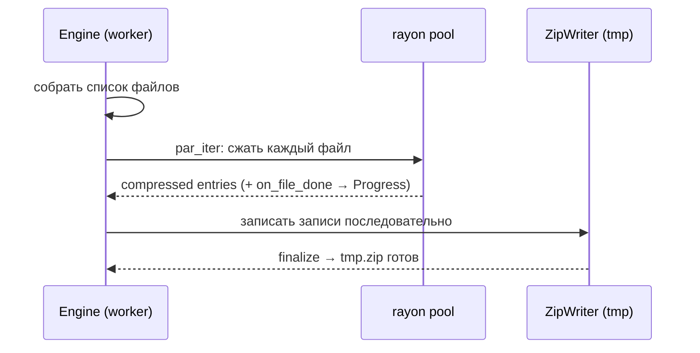
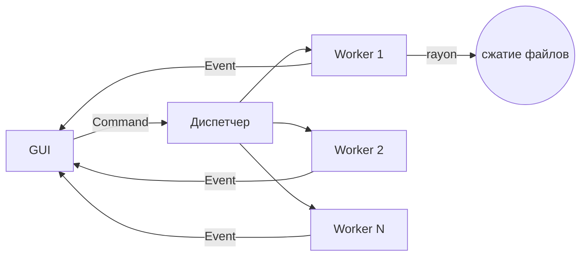

# Архитектурный дизайн — `file_transfer`

> Статус: design. Основан на `docs/requirements.md`.
> Дата: 2026-06-28
> Реализация — отдельный шаг (`/sc:implement`).

## Зафиксированные решения дизайна

- **Имя архива:** `<имя_папки>_<YYYY-MM-DD_HHMMSS>.zip`, **без перезаписи** (коллизии исключены меткой времени).
- **Сжатие:** Deflate, фиксированный уровень **6**.
- **Охват:** MVP (локальное/сетевое назначение), но с расширяемым **`trait Destination`** под SSH/S3.
- **Платформа:** macOS, GUI на `egui`/`eframe`, ядро на `rayon`.

---

## 1. Слои и структура

```
file_transfer/
├── Cargo.toml                # [lib] + [[bin]]
└── src/
    ├── lib.rs                # реэкспорт публичного API ядра
    ├── core/
    │   ├── mod.rs
    │   ├── model.rs          # JobSpec, Job, JobId, JobStatus, Progress, Config
    │   ├── archive.rs        # zip + параллельное сжатие файлов (rayon)
    │   ├── naming.rs         # генерация имени архива <папка>_<timestamp>.zip
    │   ├── transfer.rs       # trait Destination + LocalDestination
    │   ├── engine.rs         # очередь задач, воркеры, события прогресса
    │   └── error.rs          # типы ошибок (thiserror)
    └── main.rs               # GUI-слой (eframe::App), drop-зоны, прогресс
```

**Принцип:** `core/` не знает про egui. GUI общается с ядром только через каналы
(команды вниз, события вверх). Ядро можно тестировать и переиспользовать как CLI.

```mermaid
graph TD
    subgraph GUI["GUI-слой (main.rs, eframe::App)"]
        DZ1[Drop-зона «Источник»]
        DZ2[Drop-зона «Назначение»]
        PB[Прогресс / лог]
    end
    subgraph CORE["Ядро (lib)"]
        ENG[Engine<br/>очередь + воркеры]
        ARC[archive<br/>rayon zip]
        TRN[Destination<br/>trait + Local]
    end
    GUI -- "Command (mpsc)" --> ENG
    ENG -- "Event (mpsc)" --> GUI
    ENG --> ARC
    ENG --> TRN
    ARC -.tmp.zip.-> TRN
```

---

## 2. Модель данных (`core/model.rs`)

```rust
pub struct JobId(pub u64);

/// Что пользователь бросил в окно — описание одной задачи.
pub struct JobSpec {
    pub source: PathBuf,          // папка-источник
    pub destination: DestinationSpec,
    pub remove_source: bool,      // F8
    pub checksum: bool,           // F9, sha256
}

/// Назначение, выбранное в GUI (расширяется под SSH/S3).
pub enum DestinationSpec {
    Local { dir: PathBuf },       // покрывает и сетевой диск (SMB/NFS как путь)
    // Ssh  { .. }   // этап 2
    // S3   { .. }   // этап 2
}

pub enum JobStatus {
    Queued,
    Archiving { done: u64, total: u64 },   // прогресс по файлам
    Transferring,
    Done { output: PathBuf, sha256: Option<String> },
    Failed { error: String },
    Canceled,
}

pub struct Config {
    pub jobs: usize,              // воркеров параллельно (default = num_cpus)
    pub compression_level: i64,   // фиксировано 6
}
```

---

## 3. Сжатие (`core/archive.rs`)

### Алгоритм параллельного zip

zip-архив = набор независимых deflate-потоков (по файлу) + центральная директория.
Сжимаем файлы параллельно через `rayon`, записываем в архив последовательно.

```rust
pub fn archive_dir(
    source: &Path,
    out_tmp: &Path,                 // временный файл (см. атомарность)
    level: i64,
    on_file_done: impl Fn() + Sync,  // дёргает прогресс F6
) -> Result<(), CoreError>;
```

Псевдо-поток:

1. Рекурсивно собрать список файлов `Vec<RelPath>`.
2. `files.par_iter()` → для каждого: прочитать, сжать в буфер (Deflate-6) →
   `(rel_path, compressed_bytes, crc, sizes)`. После каждого — `on_file_done()`.
3. Последовательно записать готовые записи в `ZipWriter` + финализировать
   центральную директорию.



**Компромисс (риск):** сжатые буферы держатся в памяти до записи. Для типичных папок
ок; для очень больших файлов — пик памяти. → См. раздел 8, п. R1.

---

## 4. Назначение (`core/transfer.rs`)

```rust
pub trait Destination: Send + Sync {
    /// Переместить готовый tmp-архив в финальное место под именем `name`.
    /// Возвращает финальный путь/URI.
    fn deliver(&self, tmp_archive: &Path, name: &str) -> Result<PathBuf, CoreError>;
}

pub struct LocalDestination { pub dir: PathBuf }

impl Destination for LocalDestination {
    fn deliver(&self, tmp: &Path, name: &str) -> Result<PathBuf, CoreError> {
        // 1. tmp создаётся В ТОЙ ЖЕ dir → fs::rename атомарен (один том)
        // 2. при коллизии имени — не перезаписывать (ошибка/новый timestamp)
    }
}

// Этап 2: SshDestination, S3Destination — та же сигнатура deliver().
```

**Атомарность (F7):** временный файл `…/<name>.tmp-<jobid>` создаётся в каталоге
назначения, затем `fs::rename` → финальное имя. Архив появляется целиком или не
появляется вовсе. Для сетевого диска работает, пока tmp и финал на одном томе.

---

## 5. Движок и многопоточность (`core/engine.rs`)

```rust
pub enum Command {
    Submit(JobSpec),
    Cancel(JobId),
    Shutdown,
}

pub enum Event {
    Accepted { id: JobId, source: PathBuf },
    Progress { id: JobId, status: JobStatus },
    Log { id: Option<JobId>, line: String },   // F10
    Finished { id: JobId, status: JobStatus }, // Done/Failed/Canceled
}

pub struct Engine { /* cmd_tx, handle */ }

impl Engine {
    /// Запускает фоновый поток-диспетчер + пул воркеров.
    pub fn start(cfg: Config, evt_tx: Sender<Event>) -> Engine;
    pub fn submit(&self, spec: JobSpec) -> JobId;
    pub fn cancel(&self, id: JobId);
}
```

### Модель потоков

- **GUI-поток** — только egui, никогда не блокируется тяжёлой работой.
- **Диспетчер** — принимает `Command`, ведёт очередь, раздаёт задачи воркерам.
- **Пул воркеров** (`cfg.jobs`, по умолчанию = числу ядер) — каждая задача = одна папка.
- **Внутри задачи** — `rayon` параллелит сжатие файлов.



**Отмена:** воркер периодически проверяет флаг `AtomicBool` задачи между файлами;
по отмене — удаляет tmp-файл, шлёт `Finished{Canceled}`.

---

## 6. GUI ↔ Ядро (`main.rs`)

Два канала (`std::sync::mpsc` или `crossbeam-channel`):

- **GUI → Engine:** `Sender<Command>`.
- **Engine → GUI:** `Sender<Event>`; GUI в каждом кадре `update()` делает `try_recv()`
  и обновляет состояние задач.
- Чтобы UI просыпался без поллинга вхолостую — движку передаётся `egui::Context`,
  и на каждом `Event` вызывается `ctx.request_repaint()`.

```rust
struct AppState {
    engine: Engine,
    events: Receiver<Event>,
    jobs: Vec<JobView>,             // что рисуем: имя, статус, прогресс
    pending_dest: Option<PathBuf>,  // последняя «брошенная» папка назначения
    log: Vec<String>,
}

impl eframe::App for AppState {
    fn update(&mut self, ctx: &egui::Context, _: &mut eframe::Frame) {
        while let Ok(ev) = self.events.try_recv() { self.apply(ev); }
        // ctx.input(|i| i.raw.dropped_files)  → drag-drop источника/назначения (F1, F2)
        // отрисовка drop-зон, списка задач с прогресс-барами, лога
    }
}
```

**Drag-and-drop:** `egui` отдаёт `ctx.input(|i| i.raw.dropped_files)` и `hovered_files`
(для подсветки зоны). Путь определяет назначение vs источник по зоне, над которой бросили.

---

## 7. Обработка ошибок (`core/error.rs`)

```rust
#[derive(thiserror::Error, Debug)]
pub enum CoreError {
    #[error("io: {0}")] Io(#[from] std::io::Error),
    #[error("zip: {0}")] Zip(#[from] zip::result::ZipError),
    #[error("источник не папка: {0}")] NotADirectory(PathBuf),
    #[error("назначение уже содержит {0}")] DestinationExists(String),
    #[error("задача отменена")] Canceled,
}
```

Ошибка одной задачи **не валит** остальные: воркер ловит `Result`, шлёт
`Finished{Failed{error}}`, диспетчер продолжает очередь.

---

## 8. Риски и решения

| ID | Риск | Решение / план |
| -- | ---- | -------------- |
| R1 | Пик памяти при сжатии больших файлов (буферы в памяти) | MVP: ок для типичных папок. Если файл > порога — fallback на потоковую запись без параллелизма для этого файла. |
| R2 | tmp и финал на разных томах → `rename` не атомарен | tmp создаём в каталоге назначения; если копирование между томами — копия+fsync+rename, копию потом удалить. |
| R3 | egui-окно «фризится» | Вся тяжёлая работа в воркерах; GUI только рисует и читает события. |
| R4 | Сборка `.app` под две арки | `cargo bundle` / `cargo-dist`, universal binary `lipo` — деталь шага реализации. |

---

## 9. Зависимости (Cargo)

| Крейт | Назначение |
| ----- | ---------- |
| `eframe` / `egui` | GUI + drag-drop |
| `zip` | формат zip, Deflate |
| `rayon` | параллельное сжатие файлов |
| `crossbeam-channel` | каналы GUI ↔ engine (или std mpsc) |
| `sha2` | контрольная сумма (F9) |
| `walkdir` | обход дерева источника |
| `thiserror` | типы ошибок |
| `num_cpus` | дефолт числа воркеров |
| `chrono` *(или `time`)* | метка времени в имени архива |

*Этап 2:* `ssh2`/`openssh`, `aws-sdk-s3`. Конкретные версии пиннуем на шаге реализации.

---

## 10. Трассируемость требований

| Требование | Где покрыто |
| ---------- | ----------- |
| F1, F2 (drop-зоны) | §6 GUI, `dropped_files` |
| F3 (папка → zip) | §3 archive, §4 deliver |
| F4 (параллельно) | §3 rayon, §5 пул |
| F5 (очередь) | §5 диспетчер + воркеры |
| F6 (прогресс) | §2 JobStatus, §5 Event::Progress |
| F7 (атомарность) | §4 rename, R2 |
| F8 (удалить источник) | §2 remove_source |
| F9 (sha256) | §2 checksum, §9 sha2 |
| F10 (лог) | §5 Event::Log |
| F11 (сетевой диск) | §4 LocalDestination (путь) |
| F12/F13 (SSH/S3) | §4 trait Destination (этап 2) |
```
